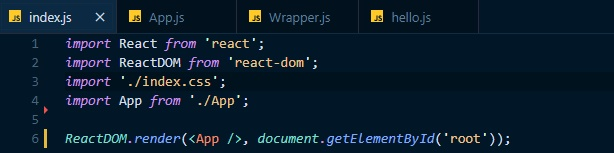
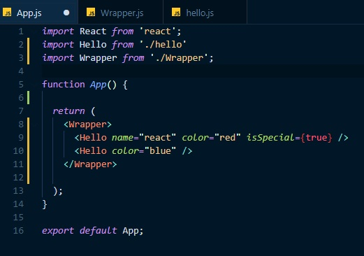
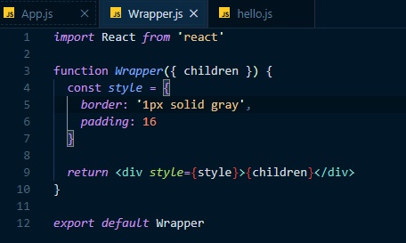
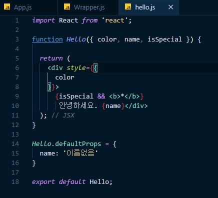

# 09 26

Node JS를 설치해야 한다.(자바스크립트 런타임 => 브라우저 뿐만 아니라 윈도우 환경에서도 JS를 동작시킬 수 있도록 해주는 소프트웨어)

npm i -g npx => npx를 활용하여 리소스 낭비 방지, 시간절약을 할 수 있다.

npx create-react-app [프로젝트이름] => 리액트 개발을 위한 풀셋팅 명령어

yarn start => yarn이 npm보다 좀 더 빠르다(?)

------

index.js에서 root라는 ID를 가진 태그에 App이라는 컴포넌트를 렌더링하는 코드이다.

App 상위 컴포넌트에 Hello와 Wrapper 라는 컴포넌트를 임포트한다.

return에 작성해준다.

Wrapper 태그 안에 Hello라는 컴포넌트를 삽입한다.

name, color, isSpecial 등의 속성들은 props로 해당 컴포넌트에 넘어가는데

객체형태로 넘어간다.

그래서 props.name, props.color를 찍어보면 해당 값이 출력된다.

------

{children}은 비구조화 할당으로 빼주었다.

컴포넌트 안에 다른 컴포넌트가 들어가는 구조에서는

반드시 상위 컴포넌트에서 children을 빼서 {children}형태로 작성해야한다.

아니면 해당 컴포넌트에서는 Hello 컴포넌트가 제대로 나오지 않을것이다.

그리고 CSS는 style로 들어가게 되는데 데이터를 객체화 하여

{style}형태로 넣어주면 된다.

---

props로 넘어온 객체에서  color, name, isSpecial을 비구조화 할당으로 빼주었다.

사용하기가 훨씬 수월해진다.

defaultProps는 말 그대로 초기 값으로 주어진 props를 말한다.

{isSpecial && <b>*</b>} 값은

