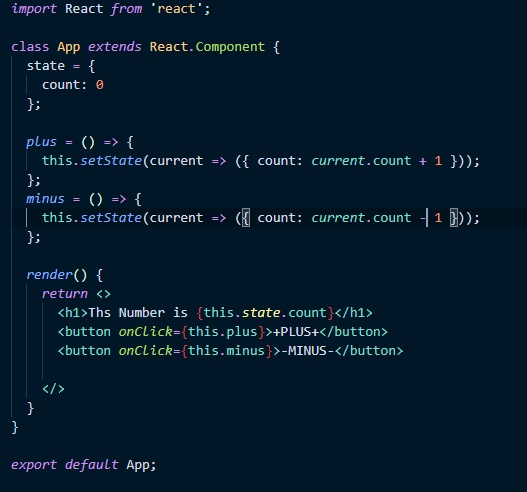
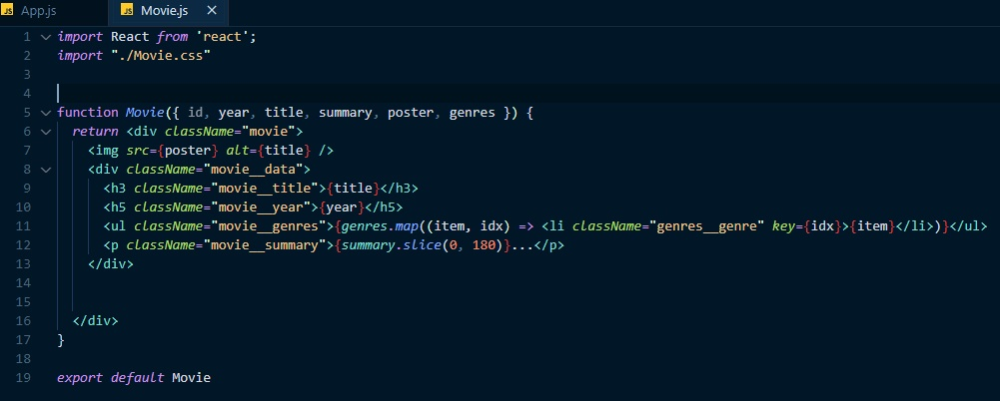
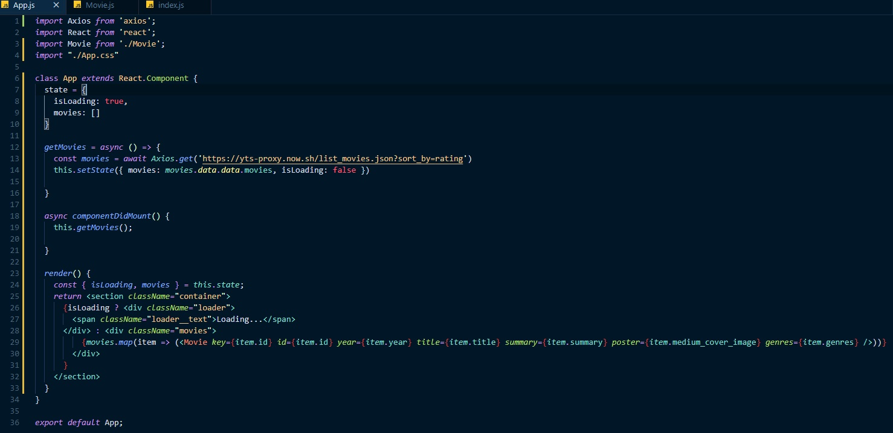

# 0927

map을 이용하여 item.id, item.name, item.image, item.rating을 사용할 수 있다.

key 프로퍼티는 해주지 않으면 warning이 뜬다.(컴포넌트 각자 고유의 키를 가져야 하기 때문이다.)

---

this.state.count 로 directly mutation은 render()를 호출하지 않기 때문에

this.setState를 해줘야 render() 호출을 하면서 다시 화면에 그려지게 된다.(업데이트 된다)

또 count : this.state.count + 1로 적을 수 있지만

인자와 콜백함수 사용이 가능하므로 current => current.count를 사용해준다.

아마 여기서 current는 state를 가리키는듯하다.

---

movie list component이다. 부모에게서 props를 넘겨받고 

바로 비구조화 할당으로 id, year, title, summary, poster, genres를 풀어주었다.

그리고 각각 렌더링해주었다.

---

getMovies 에서 async로 await이 나오면 멈추도록 설정한다.

axios는 비동기통신이기 때문에 await을 걸어주고 axios 작업이 완료될때까지 getMovies함수는 일시정지한다.

그리고 setState를 통해 movies 배열에 받아온 데이터를 넣어주고 isLoading은 false로 바꿔준다.

렌더링 메서드로 넘어가보면 isLoading일때는 로딩중이라는 메시지를 띄워주고

컴포넌트가 마운트 된 후에는 isLoading값이  false로 바뀌기 때문에 삼항연산자의 false  구문이 실행된다.

movies라는 클래스를 가진 div 안에 state에 존재하는 movies를 map함수로 풀어주게 되는데

이때 Movie 컴포넌트가 return된다.