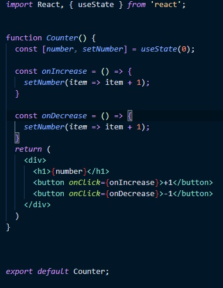
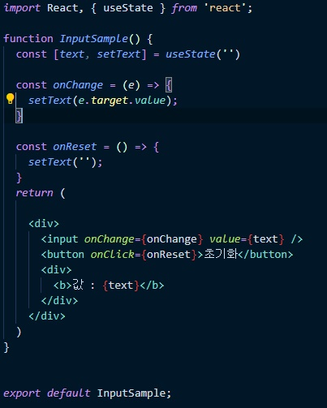

useState를 불러온다.

()안의 값은 배열의 맨 첫번째값이 된다. [0, func]

setNumber는 일종의 함수인데 첫번째 요소의 값을 콜백함수에서 참조할수있다.

리액트에서 버튼의 이벤트 발생은 onClick으로 한다. 또한 = 뒤에는 함수, 변수가 올때 {}으로 감싸준다.

---

이번 useState에서는 첫번째 원소로 공백값을 주었다.

setText에서 text에 입력할 값은 e.target.value이다.

input value에 {text}를 해준 이유는 setText로 text를 초기화 시켰을때

input 박스 안의 내용도 초기화 시켜주기 위해서 value={text}를 추가해주었다.

---

