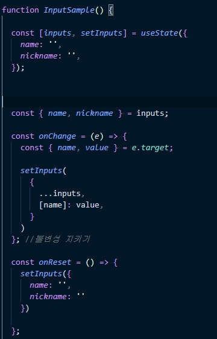
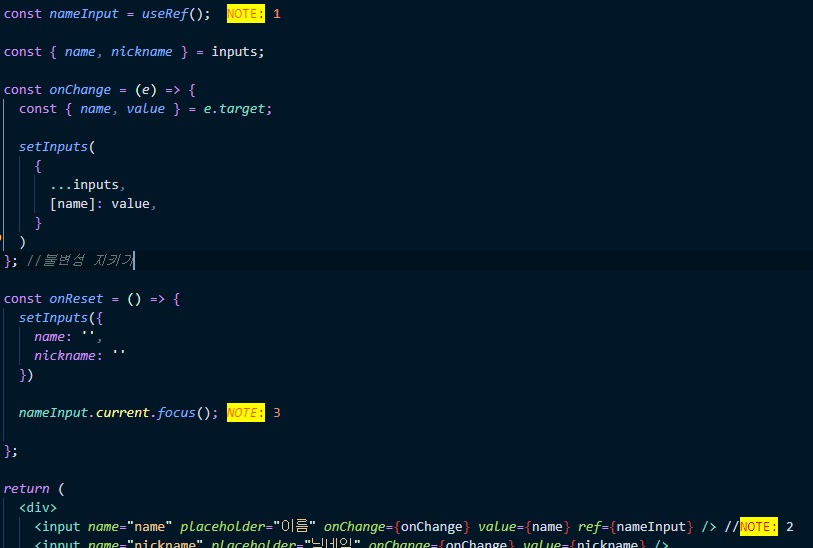
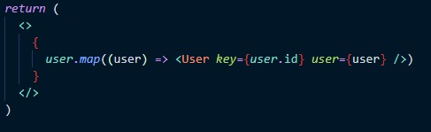
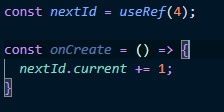

# 09 30

- 불변성 지키기

  

  

  

setInputs 안에 {...inputs, [name] : value} 가 되어있는 이유는

먼저 원본 객체를 불러온 다음에 그 위에 덮어씌워야 한다.(immutability - 불변성 지키기)

---

- useRef

  

useRef는 리렌더링 되지않고 렌더링 되더라도 변하지 않는 값이다.

DOM객체와 연결할때 사용한다.

document.querySelector('#ID') 와 비슷하게 ref 속성안에 변수를 매칭해주면 끝이다.

---

- map으로 렌더링 하는법

  

  ---

- 리렌더링 되지 않는 useRef

